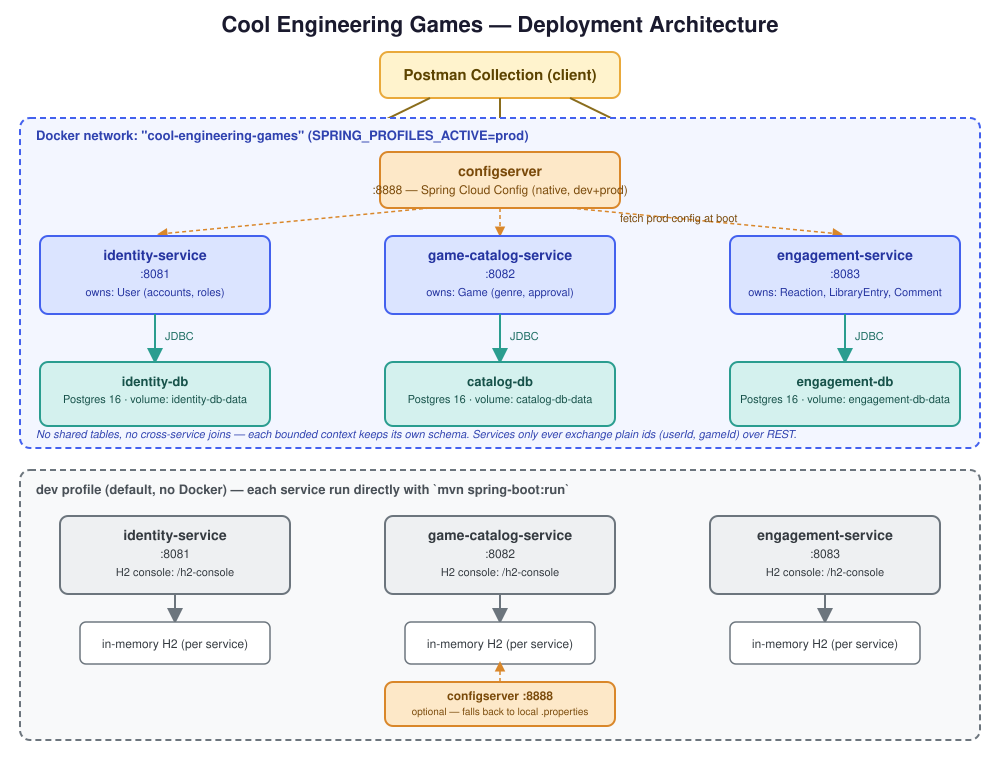

# Cool Engineering Games

A CoolMathGames-style arcade of short, engineering-themed browser games, built as a set of cloud-native microservices.

> **Phase 1 deliverables:** this README (deploy/run instructions below), the Postman collection + environment in [`postman/`](postman/), and the presentation script in [`docs/VIDEO_SCRIPT.md`](docs/VIDEO_SCRIPT.md).

## Services

| Service | Port | Owns | Status |
|---|---|---|---|
| `identity-service` | 8081 | Accounts, roles, account status | Built |
| `game-catalog-service` | 8082 | Creator-submitted games, genres, approval status | Built |
| `engagement-service` | 8083 | Likes/dislikes, library entries, comments | Built |
| `configserver` | 8888 | Centralized `dev` / `prod` configuration | Built |

Each service is its own Maven module with its own 3-layer stack (entity → repository → service → controller) and its own database — no shared tables across services.

## Canonical data model & bounded contexts

Each microservice owns one bounded context and one schema. There are no shared tables and no cross-service foreign keys — a service that needs to reference another context's data (e.g. a game's `creatorId`, a comment's `userId`) stores the plain numeric id and nothing else. Consistency across services is eventual and enforced at the REST boundary, not with database joins.

| Service | Entity | Key fields | Notes |
|---|---|---|---|
| `identity-service` | `User` | `id`, `username` (unique), `email` (unique), `passwordHash`, `role` (`PLAYER`/`DEVELOPER`/`ADMIN`), `createdAt`, `updatedAt` | Source of truth for accounts. Passwords are hashed server-side and never returned by the API. |
| `game-catalog-service` | `Game` | `id`, `title`, `description`, `genre`, `playableUrl`, `creatorId` (→ `User.id`, by value only), `approvalStatus` (`PENDING`/`APPROVED`/`REJECTED`), `createdAt`, `updatedAt` | Owns the submission/approval workflow for creator-submitted games. |
| `engagement-service` | `Reaction` | `id`, `userId`, `gameId`, `type` (`LIKE`/`DISLIKE`), `createdAt`, `updatedAt` | One reaction per `(userId, gameId)` pair (unique constraint); re-reacting updates it. |
| `engagement-service` | `LibraryEntry` | `id`, `userId`, `gameId`, `addedAt` | A player's saved-games list; one entry per `(userId, gameId)` pair. |
| `engagement-service` | `Comment` | `id`, `userId`, `gameId`, `body`, `createdAt`, `updatedAt` | Free-text comments on a game. |

`engagement-service` bundles three entities because they share one concern — a player's engagement with a game — and are always read/written together in that context; they still live in one schema with no FKs to `identity-service` or `game-catalog-service`.

## Deployment architecture



- **`prod`** (top half of the diagram): everything runs in the `cool-engineering-games` Docker network. Each service has its own Postgres container and waits on both `configserver` and its database to report healthy before starting.
- **`dev`** (bottom half): each service runs standalone on the host JVM against its own in-memory H2 database; pulling config from `configserver` is attempted but optional.
- In both profiles, the three business services never call each other directly — all cross-service reads (e.g. "does this user exist") happen at the client/Postman layer, consistent with the bounded-context boundaries above.

## Requirements

- Java 25+
- Maven 4.0.0+ (or any Maven 3.9.x works fine)
- Docker + Docker Compose, for the `prod` profile

## Running locally (`dev` profile — H2, no Docker)

Each service runs independently with an in-memory H2 database. From the repo root:

```bash
mvn -pl identity-service spring-boot:run
mvn -pl game-catalog-service spring-boot:run
mvn -pl engagement-service spring-boot:run
```

Each service also tries to pull config from `configserver` on startup (`http://localhost:8888`); if the config server isn't running, that's fine — the import is optional and each service falls back to its own local `application-dev.properties`. To run the config server too:

```bash
mvn -pl configserver spring-boot:run
```

H2 consoles (dev only): `http://localhost:808{1,2,3}/h2-console`.

## Running with Docker (`prod` profile — Postgres)

The Dockerfiles expect pre-built jars rather than building inside the container, so package first, then bring the stack up:

```bash
mvn package
```

```bash
cd docker
docker compose up --build
```

This builds and starts `configserver`, a dedicated Postgres instance per service (`identity-db`, `catalog-db`, `engagement-db`), and all three business services with `SPRING_PROFILES_ACTIVE=prod`. Services wait for the config server and their own database to report healthy before starting, then fetch their `prod` settings from `configserver` (the same values also exist as a local fallback in each `application-prod.properties`). Data lives in named Docker volumes, so it survives restarts; `docker compose down -v` wipes it.

The compose project is named `cool-engineering-games`, so it won't collide with other compose stacks on your machine. Host ports used: 8081, 8082, 8083, 8888.

## Profiles

- **`dev`** (default): H2 in-memory database per service, H2 console enabled, verbose SQL logging.
- **`prod`**: Postgres per service, H2 console disabled, quiet SQL logging. Selected via the `SPRING_PROFILES_ACTIVE=prod` environment variable (set automatically in `docker-compose.yml`).

## Database migrations

Schemas are managed by [Flyway](https://flywaydb.org), one migration history per service database, in both profiles. Scripts live in each service's `src/main/resources/db/migration/` and run automatically at startup; Hibernate is set to `ddl-auto=validate`, so it checks the schema against the entities but never changes it.

- To change a schema, add a new file, e.g. `V2__add_game_thumbnail.sql`. Never edit an already-applied `V1__...` script.
- The same SQL runs on H2 (`dev`, in PostgreSQL mode) and Postgres (`prod`), so stick to standard SQL.
- Enum columns are stored as `varchar` with a `check` constraint listing the allowed values; add new enum values with a migration that updates the constraint.
- H2 is pinned to 2.3.232 in each service's `pom.xml`: 2.4.240 has a bug that makes check constraints created by Flyway reject valid rows.

## Tests

```bash
mvn test
```

Repository tests (`@DataJpaTest`) run the real Flyway migrations on H2 and then validate them against the entities.

## Postman

Import both `postman/cool-engineering-games.postman_collection.json` and `postman/cool-engineering-games.postman_environment.json` into Postman (Import → File, select both), then pick the **Cool Engineering Games - Local** environment in the top-right dropdown. The collection has 38 requests with 65 assertions covering every endpoint of every service, including the error paths (400 / 404 / 409), and a Cleanup folder at the end so it can be re-run. Start the services first (either run mode above), then run the whole collection top to bottom with the Collection Runner. The base URLs are variables (`identityUrl`, `catalogUrl`, `engagementUrl`, `configUrl`) so they work unchanged against either profile — `dev` and `prod` expose the same ports.

From the command line with [Newman](https://www.npmjs.com/package/newman):

```bash
npx newman run postman/cool-engineering-games.postman_collection.json -e postman/cool-engineering-games.postman_environment.json
```

To submit this as a shareable **Postman Workspace** link rather than just the two files: in Postman, create a new workspace, import both files into it, then Workspace → Share → copy the invite/public link.

## Troubleshooting

If `mvn` fails to download a dependency with `PKIX path building failed` / `unable to find valid certification path`, your machine's antivirus (e.g. Avast) is doing local TLS inspection and its certificate isn't trusted by your JDK's truststore (only by Windows' own store, which is why browsers/git still work). Import it into your JDK once:

```bash
keytool -importcert -trustcacerts -noprompt -alias local-tls-proxy -file <exported-root-cert>.cer -keystore "<JAVA_HOME>/lib/security/cacerts" -storepass changeit
```
